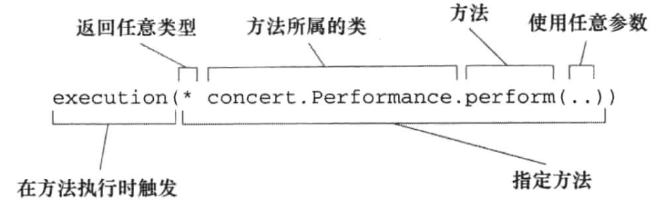

# SpringInAction

## Spring框架

简化java的开发，提高对象的可用性，灵活性。   

DI(Dependency Injection)，依赖注入，减少代码的耦合性，举勇者斗恶龙例子。勇者在类中创建了恶龙对象，并通过一个函数进行交互，但是冒险
任务并不是单一的，我们可以救公主，收集材料，制作武器，写死的代码救缺少了灵活性，通过构造器进行注入就能实现任务的传入。

AOP(Aspect Oriented Programming)，对于一些系统级别的功能，安全检查（登陆账号的验证），日志记录，事务管理，它们常常在模块各处被调用，
不便于管理，Aop通过声明的方式，将这些功能，借助DI进行使用管理。提高代码的内聚性。举吟游诗人和勇者的例子。没有AOP之前，我们需要在勇者中
声明吟游诗人，然后才能调用对应的方法，有了切面之后，我们在代码中没有显式的使用代码，而是通过xml的方式确定执行哪个代码，以及在哪里执行。

Spring应用上下文的种类


Spring中Bean的生命周期



配置Spring中的Bean  
1. 使用xml文档
2. 使用JavaConfig，加载第三方库
3. 隐式bean发现机制和自动装配，常用的  

@ComponentScan的使用
扫描发现当前类所在包下的带有@Component(name)的类，注入成Bean。  
属性，basePackages、basePackageClasses的值用来定位扫描的包位置

@Autowared自动装配  
当你需要从Spring中获取一个Bean时，用这个注解。不用这个注解会导致获取Bean时出现空指针异常，当出现多个满足条件的Bean时也会出现异常。  

@Configuration显式配置  
```Java
@Configuration
public class RedisConfig {
    @Bean
    public RedisSerializer<String> redisKeySerializer() {
        return new StringRedisSerializer();
    }
}
```  

XML配置  
构造器注入：有强依赖关系的Bean，
属性注入：不具有强依赖关系的。
c命名空间，p命名空间。

自动装配和显式装配的混合使用  
@Import(Config.class)拼接不同的JavaConfig

