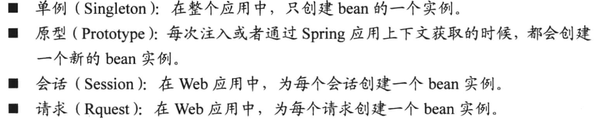
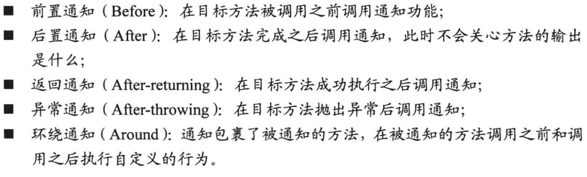

# SpringInAction

## Spring框架

简化java的开发，提高对象的可用性，灵活性。   

DI(Dependency Injection)，依赖注入，将一个Bean注入到另一个Bean的属性或构造器参数中，将两者进行关联。减少代码的耦合性，举勇者斗恶龙例子。勇者在类中创建了恶龙对象，并通过一个函数进行交互，但是冒险
任务并不是单一的，我们可以救公主，收集材料，制作武器，写死的代码救缺少了灵活性，通过构造器进行注入就能实现任务的传入，提升功能性。

AOP(Aspect Oriented Programming)，对于一些系统级别的功能，安全检查（登陆账号的验证），日志记录，事务管理，它们常常在模块各处被调用，
不便于管理，Aop通过声明的方式，将这些功能，借助DI进行使用管理。提高代码的内聚性。举吟游诗人和勇者的例子。没有AOP之前，我们需要在勇者中
声明吟游诗人，然后才能调用歌颂勇者事迹的方法，有了切面之后，在代码中没有显式的调用方法，而是通过xml文档的方式确定执行哪个代码，以及在哪里执行。  


Spring应用上下文的种类


Spring中Bean的生命周期


配置Spring中的Bean  
1. 使用xml文档
2. 使用JavaConfig，加载第三方库
3. 隐式bean发现机制和自动装配，常用的  

@ComponentScan的使用
扫描发现当前类所在包下的带有@Component(name)的类，注入成Bean。  
属性，basePackages、basePackageClasses的值用来定位扫描的包位置

@Autowired自动装配  
当你需要从Spring中获取一个Bean时，用这个注解。不用这个注解会导致获取Bean时出现空指针异常，当出现多个满足条件的Bean时也会出现异常。  

@Configuration显式配置  
```Java
@Configuration
public class RedisConfig {
    @Bean
    public RedisSerializer<String> redisKeySerializer() {
        return new StringRedisSerializer();
    }
}
```  

XML配置  
构造器注入：有强依赖关系的Bean；  
属性注入：不具有强依赖关系的。  
区别  
1、属性注入需要该Bean包含这些属性的setter方法。   
2、与传统的JavaBean的写法更相似，程序开发人员更容易理解、接收。通过setter方法设定依赖关系显得更加直观。  
3、对于复杂的依赖关系，如果采用构造器注入，会导致构造器过于臃肿，难以阅读。Spring在创建Bean实例时，同时需要实例化器依赖的全部实例，因而导致性能下降。而使用属性注入，则能避免这些问题。  
c命名空间，p命名空间是一种简写方式。

自动装配和显式装配的混合使用  
@Import(Config.class)拼接不同的JavaConfig  
XML文件中使用import标签装配

按照生产环境配置Bean  
使用@Profile(name)注解，可放在类名之上，也可放在方法上，当对应的profile激活时，装配对应的Bean，  
主要用于线上环境prod(product)、开发环境dev(development)、测试环境test、提测环境qa、单元测试unitest等。  
在application.properties中使用`spring.profiles.active=dev`进行配置。 
```java
@Configuration
public class AppConfig {

    @Conditional(OsxCondition.class)
    @Bean
    public Student student(){
        return new Student();
    }

    @Conditional(LinuxCondition.class)
    @Bean
    public Teacher teacher(){
        return new Teacher();
    }

    @Conditional(WindowsCondition.class)
    @Bean
    public Parent parent(){
        return new Parent();
    }

    @Profile("dev")
    @Bean
    public Monitors monitors() {
        return new Monitors();
    }
}
```

有条件的创建Bean  
使用@Conditional(Condition.class)，Condition的实现类用于判断当前环境是否可以创建Bean。  

处理有歧义的装配
使用@Autowired装配接口时，如果该接口有多个实现类，就会出现歧义问题。  
使用@Primary设置优先装配的Bean；  
使用@Qualifier(name)，表示限定符，可理解为类的某些特性，不可以多个进行叠加。  
搭配@Autowired装配对应类名的实现类，最好在@Component也添加@Qualifier(name)，保持name的一致。  
可使用自定义的限定符注解@Creamy，可重复叠加。

Bean的作用域  
单例是默认的装配模式，当类的状态易变时，单例模式不再适合,@Scope(ConfigurableBeanFactory.SCOPE_PROTOTYPE)。  

场景举例
会话作用域的购物车的好处，单例会让所有用户的商品加在一个购物车中，原型无法保留用户在不同位置的请求。  

懒加载  
@Lazy，懒加载针对单例模式而言，容器创建之后，不会立刻注册Bean，只有当Bean第一次被获取时才会进行注册。
```java
@Configuration
public class LazyConfig {
    @Bean
    @Lazy
    public Student getStudent() {
        System.out.println("register Bean ... ");
        return new Student();
    }
}

@SpringBootApplication
public class LazyConfigAppliction {
    public static void main(String[] args) {
        SpringApplication.run(LazyConfigAppliction.class, args);
        ApplicationContext ioc = new AnnotationConfigApplicationContext(LazyConfig.class);
        System.out.println("creating ioc ...");
        Student student = ioc.getBean(Student.class);
    }
}
```

运行时注入外部文件值  
```java
@SpringBootTest
@PropertySource("application-dev.properties")
public class EnvironmentTest {
    @Autowired
    Environment env;

    @Test
    public void EnvironmentConfig() {
        System.out.println("a:" + env.getProperty("env.a"));
    }
}
```  

AOP术语  
切面完成的工作被称为通知，确定了切面完成的工作，何时（方法的前后）去完成。  
通知类型


连接点（Joint Point）和切入点（Poincut）  
潜在的可插入切面的时机点。在哪里插入切面。  

引入（Introduction）  
引入用于修改当前类的属性和方法。  

Spring中仅支持方法级别的连接点。使用AspectJ的切点表达式来定义切点
  

## 一些坑  

SpringBoot项目打包：
IDEA中mvn package，存放在target目录下。

